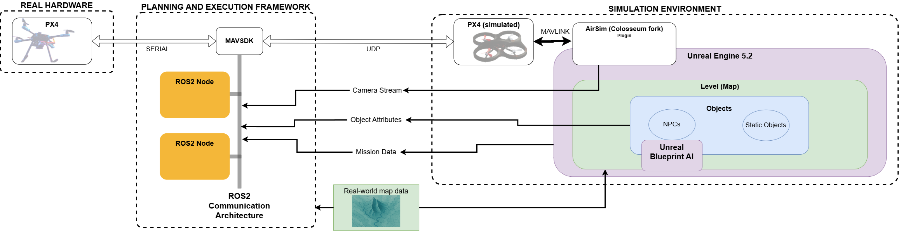

# Dynamic REAP Simulation Environment


This repository contains installation information for the Dynamic REAP simulation environment as described in the [ICAPS 2025 Demo paper](https://icaps25.icaps-conference.org/program/demos/).<br />
A demo video provides an overview of the simulation environment: https://www.youtube.com/watch?v=mthOS7hksZQ.
The legacy version of REAP presented on [ICAPS 2023](https://icaps23.icaps-conference.org/program/demos/#3216) can be found under reap-legacy tag: https://github.com/UniBwM-IFS-AILab/REAP/releases/tag/reap-legacy

To cite **Dynamic REAP**, please use the following reference: <br/>
Kai Sommer, Björn Döschl, Jane Jean Kiam. "Dynamic REAP: Bringing Life into Simulations for UAV Planning and Acting Frameworks". In: ICAPS 2025 System Demonstrations.<br/>
```
@conference{dynamicreap2025icaps,
    title = "Dyanmic REAP: Bringing Life into Simulations for UAV Planning and Acting Frameworks",
    author = "Sommer, Kai and Döschl, Björn and Kiam, {Jane Jean}",
    booktitle = {ICAPS 2025 System Demonstrations},
    year = "2025",
    month = nov
}
```

## System Requirements
We tested Dyanmic REAP using the following environment:
  - Windows 11
  - Unreal Engine 5.2.1
  - WSL2 instance with Ubuntu 22.04

## Setup of the Simulation Environment


The system overview shows the components required to run the simulation environment:

### Setup Overview
#### On Windows 11 side: **Unreal Engine 5.2.1**
  - **AirSim** plugin for Unreal: AirSim is not longer maintained. We are using the Colosseum fork: [Colosseum](https://github.com/CodexLabsLLC/Colosseum)
     - preconfigured setting file for AirSim can be found in `configs/settings.json`
  - **Unreal Level** (including the landscape)
  - **Unreal Blueprints**
    - for autonomous NPC movement (`NPC.T3D`)
    - for events happening to NPCs: e.g. injury or loss of orientation (`EventBox.T3D`)
    - Third-Person mode (`NPC.T3D`)
    - for georeferencing of objects (`Object.T3D` or `GeoSetter.T3D`)
  - **Python Scripts**
    *the python scripts can be executed from Unreal Blueprints using Execute Console Command:* `py /path/to/script.py`
    - to send mission data to the planning framework (`call_for_help.py` and `search_mission_daemon.py`)
    - to export Unreal Engine object GPS positions and metadata to JSON (`dump_json.py`)

#### On Ubuntu 22.04 inside WSL2: **Planning and Execution Framework**:
  - for the integration of a planning and execution framework see [Integration of a planning and execution framework](#integration-of-a-planning-and-execution-framework)

### Option 1: Using ready-made Unreal level

The easiest way for trying out is to use our ready-made Unreal level, which includes all necessary blueprints.
This Unreal level was designed to test Automated Planning for UAVs in search and rescue scenarios and includes a real-world map of the Tannheimer Tal.
> **💡**
> Unfortunately, this Unreal project is about 60 GB in size, so we cannot upload it to GitHub.
> If you’re interested, we’d be happy to share the project with you directly via a file-sharing link (e.g. GigaMove).

### Option 2: Building an own Unreal level

If you are interested in building your own Unreal Level, we recommend to start with a height map from here: [Unreal PNG Heightmap](https://manticorp.github.io/unrealheightmap/#latitude/47.5172006978394/longitude/10.6210327148438/zoom/11/outputzoom/13/width/505/height/505).
- download the `heightmap.png`, create empty Unreal Project and import it the heightmap (`Landscape -> Manage -> Import from File`)
- enter the scaling computed by the Unreal Heightmap tool and click on `Import`
- the landscape features (like textures, trees, ...) have to be added manually.
- the blueprints necessary for NPC movement, georeferencing and further features of Dynamic REAP can be integrated to your project.

### Integration of a planning and execution framework

In principle, you can connect any planning and execution framework to control the UAV in Dynamic REAP. The only requirement is an interface to the PX4 SITL flight controller, e.g., via MAVLink. For the planner to access Unreal’s internal data, a knowledge base for storing JSON-based data is recommended.
As proof-of-concept we connected the AUSPEX framework, which already implements the required interfaces. An installation for AUSPEX guide can be found here: [AUSPEX](https://github.com/UniBwM-IFS-AILab/AUSPEX). Furthermore, AUSPEX is modular in design and can also be extended with your custom planning algorithms.

## Contact Information

Write us for questions, help for installation, or even future collaboration at fmff.lrt@unibw.de
